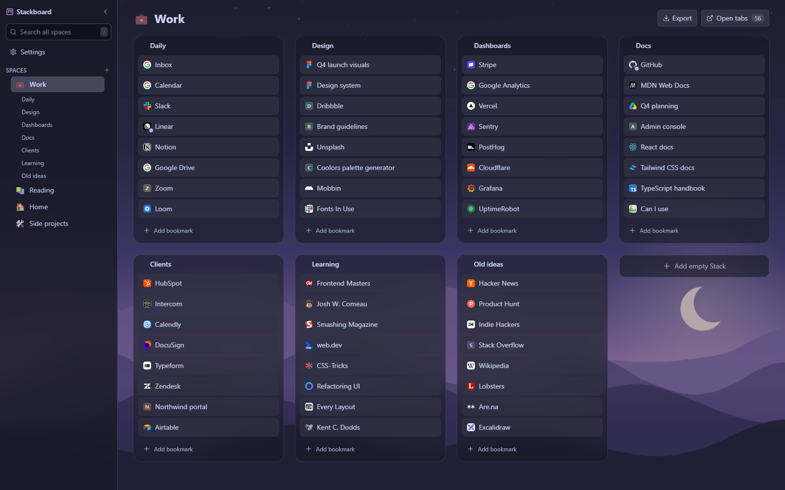

# Stackboard

Your Chrome bookmarks as a board on the new tab page. Spaces down the side, stacks of links across, and you can drag anything anywhere.

**[Get it free on the Chrome Web Store](https://chromewebstore.google.com/detail/bgcedhchngcopaefchpkbhioagknnpma?utm_source=github&utm_medium=readme&utm_campaign=oss)**



## What it does

- **Themes:** Catppuccin (Latte and Mocha), Gruvbox (light and dark), Nord, and the cream default with a dark version, all in their official colors. Light, dark or follow your system, plus gradients or your own wallpaper with dim and blur. Compact density for big boards, and keys 1 to 9 switch spaces.
- **First run:** copies your bookmarks bar and its folders into a board, one stack per folder. Your originals stay where they are. No bookmarks yet? Pick a starter pack.
- **Drag everything:** spaces, stacks and links, within and across stacks.
- **Undo every delete** with the toast or Ctrl+Z. Chrome has no trash for bookmarks, so this matters.
- **Cards are real links:** Ctrl+click, middle-click and the right-click menu work the way your browser already does. A dot marks links that are already open, and clicking one jumps to that tab.
- **Search every space** from the sidebar (press `/`).
- **Stash this window** (Alt+Shift+S or the toolbar popup): saves every open tab as a stack, one per tab group, and can close them. Open the stack later and they come back as a tab group.

## Where your data lives

Everything is plain Chrome bookmarks under **Other bookmarks → Stackboard** (space folders, then stack folders, then bookmarks). So it syncs through Chrome sync, works offline, and if you uninstall the extension your bookmarks stay put.

No account, no server, no analytics. A few preferences (last space opened, your theme, whether you've answered the one-time rating ask) stay in local storage on your device, and a wallpaper you pick stays in the browser's local database on that device. [Privacy policy](https://stackboard.vercel.app/privacy)

## Permissions

| Permission | Why |
|---|---|
| `bookmarks` | Read and write the Stackboard folder; read your other folders only when you choose to copy them in |
| `tabs`, `tabGroups` | The "already open" dot, saving the current tab, stashing a window and reopening it as a group |
| `storage` | A few local flags (first-run hints) and your appearance settings |
| `favicon` | Site icons from Chrome's own favicon cache |

## Build it yourself

```bash
npm install
npm run build
```

Then open `chrome://extensions`, turn on **Developer mode**, click **Load unpacked** and pick the `dist` folder. `npm run dev` gives you hot reload while you work.

## Tests

- **Unit** (pure logic: titles, icons, import and stash planning, the rating rule, and contrast checks for every palette):

  ```bash
  npx esbuild tests/unit.test.ts --bundle --platform=node --format=esm --loader:.css=text --outfile=unit.mjs && node unit.mjs
  ```

- **End to end** in a real browser: Chrome for Testing plus puppeteer-core, because branded Chrome ignores `--load-extension` since Chrome 137. Setup and run instructions are in the header of [tests/e2e.mjs](tests/e2e.mjs).

## Stack

Manifest V3, React 18, TypeScript, Vite with the crxjs plugin, Tailwind 4, Zustand and dnd-kit. Built with Claude Code.

## License

[MIT](LICENSE)
